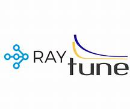

[Machine Learning](#Machine-Learning) | [Exploratory Data Analysis](#Exploratory-Data-Analysis) | [Deep Learning](#Deep-Learning) | [Evolutionary Algorithms](#Evolutionary-Algorithms) | [Natural Language Processing](#Natural-Language-Processing) | [Computer Vision](#Computer-Vision) | [MLOps](#MLOps)   
  

## Machine Learning
 
<table>
	<tr valign="top">
		<td> Supervised Learning</td> 
		<td>Regression and classification problems. Simple and multiple linear regression. Simple and multiple logistic regression.  Multiclass logistic regression. Naive Bayes. K-Nearest Neighbors. Support Vector Machine. Decision Trees - Classification & Regression Trees. Neural Networks (Perceptron, Feedforward). Ensemble methods (Voting, Bagging (e.g., Random Forest), Boosting (e.g., AdaBoost, Gradient Boosting, XGBoost)).</td>
	</tr>
	<tr valign="top">
		<td> Unsupervised Learning </td> 
		<td>
			<ul>
				<li>Clustering  (e.g., K-means, Elbow Method, Gaussian Mixture Model).</li> 
				<li>Dimensionality Reduction (e.g., PCA, UMAP).</li> 
			</ul>
		</td> 
	</tr>
	<tr valign="top">
		<td>Reinforcement Learning </td> 
		<td>Markov Decision Process. Prediction vs. Control Problems. Policy-Based vs. Value-Based Algorithms. Iterative Solutions. Q-Learning.</td> 
	</tr>
<table>
 

<ul>
  <li>Performance metrics.</li>
  <li>Hyperparameter Tuning.  
    <ul>
      <li>Grid Search | Random Search | Local Beam Search | Bayesian Optimization | Genetic Algorithms | Gradient-based Optimization | Simulated Annealing </li>
      <li>Hyperparameter Optimization Libraries/Frameworks</li>
    </ul>
  </li>
</ul>  
  
  
  
 

## Exploratory Data Analysis

## Deep Learning

## Evolutionary Algorithms

## Natural Language Processing

## Computer Vision

## MLOps

  

  

  

