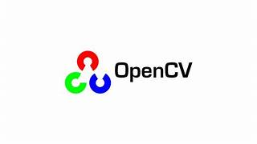
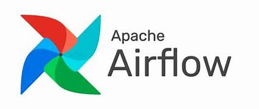

[Machine Learning](#Machine-Learning) | [Exploratory Data Analysis](#Exploratory-Data-Analysis) | [Deep Learning](#Deep-Learning) | [Evolutionary Algorithms](#Evolutionary-Algorithms) | [Natural Language Processing](#Natural-Language-Processing) | [Computer Vision](#Computer-Vision) | [MLOps](#MLOps)   
  

<h2 id="Machine-Learning">Machine Learning</h2>
 
<table>
	<tr>
		<td class="styled-cell"> Supervised Learning</td> 
		<td>
			<ul>
				<li>Regression and classification problems.</li>
				<li>Simple and multiple linear regression.</li>
				<li>Simple and multiple logistic regression.  Multiclass logistic regression.</li>
				<li>Naive Bayes.</li>
				<li>K-Nearest Neighbors.</li>
				<li>Support Vector Machine.</li>
				<li>Decision Trees - Classification & Regression Trees.</li>
				<li>Neural Networks (Perceptron, Feedforward).</li>
				<li>Ensemble methods (Voting, Bagging (e.g., Random Forest), Boosting (e.g., AdaBoost, Gradient Boosting, XGBoost)).</li>
			</ul>
		</td>
	</tr>
	<tr>
		<td class="styled-cell"> Unsupervised Learning </td> 
		<td>
			<ul>
				<li>Clustering  (e.g., K-means, Elbow Method, Gaussian Mixture Model).</li> 
				<li>Dimensionality Reduction (e.g., PCA, UMAP).</li> 
			</ul>
		</td> 
	</tr>
	<tr>
		<td class="styled-cell">Reinforcement Learning </td> 
		<td>
			<ul>
				<li>Markov Decision Process.</li>
				<li>Prediction vs. Control Problems.</li>
				<li>Policy-Based vs. Value-Based Algorithms.</li>
				<li>Iterative Solutions.</li>
				<li>Q-Learning.</li>
			</ul>
		</td> 
	</tr>
<table>
 

<ul>
  <li>Bias. Variance. Performance metrics.</li>
   
  <li>Strategies to reduce empirical risk</li>
	<ul>
		<li>Regularization (L1, L2, Elastic).</li>
		<li>Cross Validation (e.g., K-fold).</li>
		<li>Early Stopping.</li>
		<li>Ensemble Methods.</li>
		<li>Data Augmentation.</li>
		<li>Dimensionality Reduction.</li>
		<li>Hyperparameter Tuning.  
		    <ul>
		      <li>Grid Search | Random Search | Local Beam Search | Bayesian Optimization | Genetic Algorithms | Gradient-based Optimization | Simulated Annealing </li>
		      <li>Hyperparameter Optimization Libraries/Frameworks</li>
		    </ul>
		</li>
	</ul>
</ul>  

  &nbsp;&nbsp;&nbsp;
  &nbsp;&nbsp;&nbsp;
    

 
  
    
 
<h2 id="Exploratory-Data-Analysis">Exploratory Data Analysis</h2>
 
<table>
	<tr>
		<td class="styled-cell">Data Understanding</td> 
		<td>
			<ul>
				<li>Data Inspection.</li> 
				<li>Data Visualization.</li>
				<li>Domain Knowledge Exploration.</li>
				<li>Data Relationship Identification.</li>
				<li>Data Quality Assessment.</li>
				<li>Statistical data analysis.</li>
					<ul>
						<li>Univariate Analysis (Descriptive Statistics, Frequency Distribution)</li>
						<li>Bivariate / Multivariate Analysis (e.g., Correlation Analysis (Pearson, Spearman), Scatter Plots, Pair Plots, Correlation Matrix)</li>
					</ul>	
			</ul>
		</td>
	</tr>
	<tr>
		<td class="styled-cell">Data Cleaning</td> 
		<td>
			<ul>
				<li>Missing Value Imputation (Univariate / Multivariate Imputation Methods).</li> 
				<li>Data Inconsistency Correction.</li>
				<li>Outlier Detection and Treatment</li>
			</ul>
		</td> 
	</tr>
	<tr>
		<td class="styled-cell">Feature Engineering</td> 
		<td>
			<ul>
				<li>Feature Selection / Extraction.</li>
				<li>Data Transformation.</li>
				<ul>
					<li>Binning.</li>
					<li>Normalization/Standardization/Scaling.</li>
					<li>Encoding Categorical Features (One-hot encoding vs. Label encoding)</li>
				</ul>
			</ul>
		</td> 
	</tr>
	<tr>
		<td class="styled-cell">Dimensionality Reduction</td> 
		<td>
			<ul>
				<li>PCA.</li>
				<li>t-SNE.</li>
			</ul>
		</td> 
	</tr>

<table>
  
<h2 id="Deep-Learning">Deep Learning</h2>
 
<ul>
	<li>Activation | Loss Functions.</li>
	<li>Regularization techniques.</li>
	<li>Embedding Layers.</li>
	<li>Feedforward Neural Networks (FNN).</li>
	<li>Convolutional Neural Network (CNN).</li>
	<li>Recurrent Neural Networks (RNN).</li>
	<li>Attention Layers.</li>
	<li>Encoder-Decoder. Autoencoder.</li>
	<li>Generative Adversarial Networks (GANs).</li>
	<li>Transfer Learning Strategies (e.g., Fine tuning, Feature Extraction).</li>
</ul>	
 
  
  
 

<h2 id="Evolutionary-Algorithms">Evolutionary Algorithms</h2>
<ul>
	<li>Optimization | Modeling | Simulation Problems</li>
	<li>Heuristics | Metaheuristics | Hyperheuristics</li>
	<li>Fitness functions | Selection | Crossover | Mutation | Elitism </li>
	<li>Particle Swarm Optimization (PSO, MOPSO)</li>
	<li>Swarm Intelligence</li>
</ul>	
 
  
    
 
<h2 id="Natural-Language-Processing">Natural Language Processing</h2>
 
<ul>
	<li>Vectorization.</li>
	<li>Word embeddings.</li>
	<li>Tokenization.</li>
	<li>RNNs (Elman, LSTM, GRU).</li>
	<li>CNNs. Text Classification.</li>
	<li>Seq2seq (Translations, Q&A bots).</li>
	<li>Attention Mechanisms.</li>
	<li>Transformers.  GPT.</li>
	<li>BERT | ELMo.</li>
	<li>Language models.</li>

</ul>
 
  
  
 

<h2 id="Computer-Vision">Computer Vision</h2>
 
<table>
	<tr>
		<td class="styled-cell">Traditional CV tecniques</td> 
		<td>
			<ul>
				<li>Pixel Operators | Chromatic Coordinates | White-patch | Histogram Equalization.</li>
				<li>Binarization (Global Thresholding, Adaptive Thresholding, OTSU).</li>
				<li>Image Filtering.</li>
					<ul>
						<li>Linear Filters (Convolution).</li>
						<li>Smoothing Filters (e.g., Gaussian Blur).</li>
						<li>Sharpening Filters (e.g., Unsharp masking).</li>
						<li>Non-Linear Filters.</li>
						<li>Edge Detection Filter (Sobel, Prewitt, Canny , LoG).</li>
						<li>Morphological Filters.</li>
						<li>Frequency Domain Filters (Fourier).</li>
					</ul>	
				<li>Image Classification</li>
				<li>Object Detection (Harris, Shi Tomasi, Hough). Template matching.</li>
				<li>Image Segmentation (Semantic vs. Instance Segmentation).</li>
				<li>Feature Extraction (SIFT, SURF, ORB, FAST, HoG , LBP).</li>
				<li>Video Processing  (Optical flow , Background Subtraction, Object Tracking).</li>
			</ul>
		</td>
	</tr>
	<tr>
		<td class="styled-cell">Deep Learning in CV</td> 
		<td>
			<ul>
				<li>Data Augmentation.</li>
				<li>Transfer Learning.</li>				
				<li>Neural Style Transfer.</li>
				<li>NN Architectures:</li>
				<ul>
					<li>AlexNet.</li>
					<li>VGGNet.</li>
					<li>ResNet.</li>
					<li>Inception Architecture.</li>
					<li>R-CNN.</li>
					<li>Fast R-CNN.</li>
					<li>Faster R-CNN.</li>
					<li>YOLO.</li>
					<li>SSD.</li>
					<li>RetinaNet.</li>
					<li>Generative Networks.</li>
					<li>Visual transformers.</li>
				</ul>
			</ul>
		</td>
	</tr>
</table>
 

    

 
  
  
 

<h2 id="MLOps">MLOps</h2>
 
<ul>
	<li> Model Versioning (Git, MLFlow).</li>
	<li> Model Deployment (Batch Processing, Online/Real-time inference | Rest APIs).</li>
	<li> Containerization and Orchestration (Docker, Apache Airflow).</li>
</ul>

  &nbsp;&nbsp;&nbsp;
  &nbsp;&nbsp;&nbsp;
    

  

  

